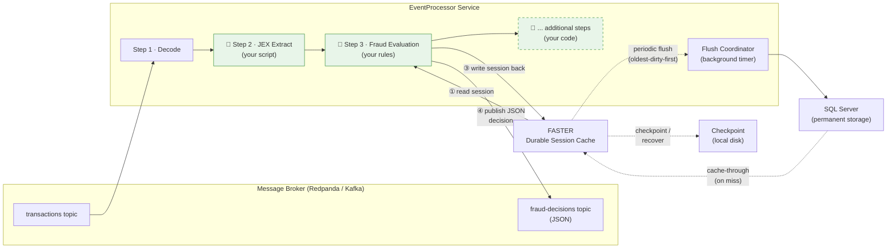

# EventProcessor — Capabilities & Design

## What Is This?

The EventProcessor is a **real-time fraud detection service**. It watches a stream of financial transactions as they happen, decides whether each one looks suspicious, and publishes that decision so downstream systems can act on it (block the transaction, flag it for review, or let it through).

It processes transactions **one at a time, very fast** — the goal is sub-millisecond decisions so legitimate customers are not slowed down.

---

## How It Works — The Big Picture



> **Green boxes (🔧) are extensibility points** — they are where you plug in your own behaviour without modifying the framework code. The dashed box represents optional additional pipeline steps you can insert.

**Why FASTER exists:** It is a durable in-memory cache that accumulates the full transaction history per customer. When a new transaction arrives, Step 3 **reads** that customer's session **from FASTER** first — that's how it knows the customer already spent 45,000 NOK in 3 previous transactions. After scoring, it **writes** the updated session (now 100,000 NOK across 4 transactions) **back to FASTER** so the *next* transaction for that customer will see the full picture. Without FASTER, every transaction would be evaluated in isolation with no knowledge of what came before.

If a session isn't in FASTER (e.g., after the service restarts or if it was evicted for being idle), the system automatically **loads it from SQL** (cache-through) so no history is ever lost. The SQL flush runs on a background timer in **oldest-dirty-first** order; FASTER also **checkpoints to local disk** periodically for crash recovery.

---

## Walking Through a Single Transaction

Imagine a transaction arrives from Kafka: *"NID 12345678 spent 55,000 NOK at a merchant in Russia."*

### Step 1 — Decode

The raw message arrives as a stream of bytes. This step converts those bytes into a readable JSON text string. If the message is empty or corrupted, processing stops here — the record is discarded and an error is logged.

### Step 2 — JEX Field Extraction

Transaction messages can come from different source systems with different field names (e.g., one system calls it `"customerId"`, another calls it `"nid"`, another calls it `"nationalId"`). The JEX extractor is a small script that normalizes all of these into a single consistent format:

| Output field | Meaning |
|-------------|---------|
| `nid` | The customer's national ID number |
| `amount` | Transaction amount |
| `countryCode` | Where the transaction happened |
| `transactionId` | Unique transaction reference |
| `timestamp` | When it happened |

This means the fraud rules don't need to know about source system differences — they always see the same clean fields.

### Step 3 — Fraud Evaluation

This is where the actual fraud detection happens. Several things occur in order:

**3a. Find the customer's session**

Every customer (identified by NID) has a *session* — a running record of their recent activity. The system looks up this session in the in-memory store. If this is the first transaction we've seen for this NID, a new session is created.

> **Why is the session important?** A single transaction of 500 NOK is fine. But if the same person has made 15 transactions in the last minute totaling 120,000 NOK, that pattern is suspicious. The session gives us that history.

**3b. Update the session with this transaction**

- Increment the transaction count
- Add the amount to the running total
- Record the country (if this is the first transaction, it becomes the customer's "base country")
- Add the transaction to the full lifetime transaction list

**3c. Run the fraud rules**

Five rules are evaluated against the transaction *and* the session:

| Rule | What it checks | Why it matters |
|------|---------------|----------------|
| **High Amount** | Is this single transaction over 10,000? | Large individual transactions are higher risk |
| **Very High Amount** | Is this single transaction over 50,000? | Even higher risk — weighted more heavily |
| **Rapid Transactions** | Has this NID made more than 10 transactions in this session? | Burst activity is a common fraud pattern |
| **Unusual Location** | Is this transaction from a different country than the customer's base country? | Unexpected geography is suspicious |
| **Large Session Total** | Has this NID's session total exceeded 100,000? | High cumulative spending is a risk indicator |

Each rule that matches adds a **score modifier** (a number between 0 and 1, configurable). The modifiers are added together to get a total fraud score.

**3d. Make a decision**

| Total score | Decision | Meaning |
|-------------|----------|---------|
| Below 0.5 | **Allow** | Transaction looks normal |
| 0.5 to 0.99 | **Flagged** | Suspicious — send for human review |
| 1.0 or above | **Blocked** | Very likely fraud — reject automatically |

For our example: the 55,000 NOK transaction from Russia would trigger **VeryHighAmount** (score: 0.6) + **HighAmount** (score: 0.3) + **UnusualLocation** (score: 0.5) = total 1.4 → **Blocked**.

**3e. Save and publish**

- The updated session (with new score and triggered rules) is written back to the in-memory store
- The fraud decision is published as **JSON** to the `fraud-decisions` Kafka topic so any downstream consumer can read it with standard tooling — no special deserializer required

Example output message:
```json
{
  "score": 1.4,
  "decision": "Blocked",
  "decidedAt": "2026-04-15T10:30:00+00:00",
  "triggeredRuleNames": ["VeryHighAmount", "HighAmount", "UnusualLocation"]
}
```

---

## The In-Memory Session Store (FASTER)

### What is it?

FASTER is a high-performance key-value store from Microsoft Research. We use it as an **in-memory dictionary** — think of it as a giant lookup table where the key is the customer's NID and the value is their fraud session.

### What exactly is stored per session?

| Field | What it is |
|-------|-----------|
| NID | The customer identifier (the lookup key) |
| Status | Active, Closed, Flagged, or Blocked |
| Created at | When we first saw this NID |
| Last activity | Timestamp of most recent transaction |
| Transaction count | How many transactions in this session |
| Total amount | Sum of all transaction amounts |
| Transactions | Full lifetime transaction list (ID, amount, time, country) |
| Earliest transaction at | When the oldest transaction in the current slab occurred (used for archival decisions) |
| Base country | The country from the customer's first transaction |
| Current fraud score | Latest calculated score |
| Triggered rules | Which rules matched on the last evaluation |
| Decision | The most recent Allow / Flagged / Blocked decision |

### Why in-memory? Why not just use the database?

**Speed.** The fraud check must happen while the transaction is in progress. A database round-trip typically takes 5–20 milliseconds. An in-memory lookup in FASTER takes **under 1 millisecond**. When you're processing thousands of transactions per second, that difference matters enormously.

### How is it organized? (Bucket routing)

Imagine 64 filing cabinets (this number is configurable). When a transaction arrives for NID "12345678", the system hashes that NID to determine which cabinet to use — say, cabinet #23. It opens that cabinet, finds the folder (or creates a new one), and does the lookup.

The key benefit: **different cabinets can be accessed simultaneously**. If two transactions arrive at the same time for two different NIDs that map to different cabinets, they don't wait for each other.

### What happens when the service shuts down?

**No data is lost.** On shutdown the service:

1. **Flushes every remaining dirty session** to SQL Server
2. **Takes a FASTER checkpoint** to local disk

This means both SQL and the local checkpoint contain the full, up-to-date state.

### What happens at startup?

**Full recovery.** The service:

1. **Recovers the FASTER checkpoint** from local disk — this restores the in-memory hash index in milliseconds, so sessions that were in memory before shutdown are immediately available again
2. **Rebuilds internal tracking maps** (dirty timestamps, last-activity timestamps) by scanning the recovered log
3. Begins consuming transactions — there is no warm-up gap

If a session is not in FASTER (e.g., it was evicted for being idle, or the checkpoint is missing), the system loads it **on demand from SQL** as part of the cache-through pattern. This means the service is **fully operational from the first transaction after startup**, even after a crash where no clean shutdown checkpoint was taken.

### Idle Eviction

Sessions that have not been accessed for a configurable period (default: **40 minutes**) are automatically evicted from FASTER to free memory. Eviction skips any session that still has unsaved (dirty) changes — those are flushed to SQL first on the next flush cycle, then evicted on the following eviction pass.

If an evicted session is needed again (a new transaction arrives for that NID), the cache-through mechanism loads it back from SQL transparently.

---

## The Flush Coordinator — Saving to SQL

The Flush Coordinator runs on a timer in the background, separate from transaction processing. On each cycle it performs three jobs:

### 1. Flush Dirty Sessions (oldest-dirty-first)

Sessions that have been modified are saved to SQL in **oldest-dirty-first order** — the session that has been waiting longest to be saved goes first. This ensures that no session sits unsaved for an unbounded time, even under sustained high throughput.

Sessions are saved via the **Session Repository**, which uses MERGE (upsert) logic to insert new rows or update existing ones.

### 2. Evict Idle Sessions

After flushing, the coordinator evicts sessions that have been idle longer than the configured timeout (default 40 minutes). This keeps the memory footprint bounded without losing any data — evicted sessions will be loaded back from SQL on demand if needed.

### 3. Periodic Checkpoint

Every N flush cycles (default: 6), the coordinator triggers a FASTER checkpoint to local disk. This is a safety net — if the process crashes between checkpoints, the last checkpoint plus the SQL data together contain all history.

### Time-Slabbed Archival

Session data in SQL is organized into **time slabs**. Each customer (NID) has a "current" slab that grows as new transactions arrive. When the span of transactions in the current slab exceeds a configurable threshold (default: **120 days**), the oldest month of data is sliced off into a separate **archive slab** row (keyed by `yyyy-MM`).

When loading a session, the system reads the current slab plus any archive slabs within the **lookback window** (default: **180 days**) and merges them into a single session. On save, only the current slab is written — archive slabs are immutable once created.

This design means:
- The "current" slab stays small and fast to serialize
- Historical data is preserved indefinitely with minimal overhead
- The lookback window is configurable per deployment — increase it for deeper history, decrease it for faster loads

SQL is **eventually consistent** — it reflects the state of sessions from a few seconds ago, not the exact current instant. For dashboards and reporting this is perfectly fine; for real-time fraud decisions the service uses the in-memory store.

---

## Observability — How We Know It's Working

### Health Checks

The service exposes standard health endpoints that monitoring tools can poll:

| Endpoint | What it tells you |
|----------|-------------------|
| `/health/live` | Is the process alive? |
| `/health/ready` | Is it connected to Kafka and SQL and able to process? |

### Logging

Every significant event is logged with a structured ID, making it easy to search and filter:

| ID range | Area | Examples |
|----------|------|---------|
| 1000s | Application | Startup, shutdown, configuration changes |
| 2000s | Kafka | Messages consumed, batches processed, errors |
| 3000s | Field extraction | Script loaded, extraction failures |
| 4000s | Fraud rules | Rules loaded, rules matched, decisions made |
| 5000s | Session store | Sessions created, flushed to SQL |
| 6000s | SQL | Settings loaded, persistence errors |

### Metrics

Timing and throughput metrics are collected for all key operations — how fast batches are processed, how long field extraction takes, how long flush cycles take. These can be consumed by a real-time dashboard (planned).

---

## Live Configuration

Rules and thresholds can be changed **without restarting the service**. Settings are stored in SQL Server and the service polls for changes. When an operator updates a rule's score modifier or enables/disables a rule, the change takes effect within seconds.

This means: if fraud patterns shift, the team can adjust thresholds immediately rather than waiting for a code deployment.

---

## Testing

The system has **58 automated tests** covering:

- **Session store** (13 tests): Creating, reading, updating, and flushing sessions; verifying bucket routing distributes evenly; oldest-dirty-first drain ordering; idle eviction (stale sessions removed, dirty sessions skipped); checkpoint-and-recover round-trip; cache-through loading from SQL on miss
- **Fraud rules** (12 tests): Each of the 5 rules tested individually; disabled rules are skipped; rules reload when configuration changes
- **Full pipeline** (8 tests): End-to-end processing of transactions through all three steps; verifying session accumulation, country detection, decision output, and unbounded lifetime transaction history
- **Configuration validation** (10 tests): All required settings verified at startup; the service refuses to start with invalid configuration
- **Health checks** (8 tests): Health endpoints correctly reflect the state of each dependency
- **Field extraction** (4 tests): Valid and invalid input handling
- **Decision producer** (2 tests): The "off switch" (no-op producer) works correctly

**Performance benchmarks** are also available, measuring session store throughput at 1,000 and 10,000 session scales, and rule engine evaluation speed.

---

## Customization & Extensibility

The EventProcessor is designed as a **framework you install once, then customize without touching its internals**. The processing flow (Kafka → decode → extract → evaluate → publish) is fixed infrastructure. What changes between deployments is *your* business logic — your field mapping, your rules, and optionally your own pipeline steps.

### What's Fixed (the framework)

| Component | What it does | Why you don't touch it |
|-----------|-------------|------------------------|
| Kafka consumer loop | Reads batches from the topic, dispatches to the pipeline | Handles offsets, retries, health reporting |
| Decode step | Converts raw bytes → UTF-8 string | Universal — there's nothing to customize |
| FASTER session store | Reads/writes per-NID sessions at sub-millisecond speed | Internal performance plumbing |
| Flush coordinator | Periodically saves changed sessions to SQL | Background durability — runs on a timer |
| Health checks, logging, metrics | Standard observability | Consistent structure across all deployments |

### What You Customize

#### 1. JEX Field Extraction Script

**What:** The JEX script that maps your source system's JSON fields to the canonical format the rules expect.

**How:** Provide your own JEX script. The built-in default handles common field name variations (`customerId`, `nid`, `nationalId`, etc.), but if your source data uses different names or structures, you write a script that maps them. This is a small text — typically 10–15 lines.

**Impact:** Changes which fields are available to the rules. No code changes needed — just a different script.

#### 2. Fraud Rules

**What:** The rules that determine whether a transaction is suspicious.

**How — without code:** Each rule has a name, a score modifier, and an enabled flag. You can change these values in SQL settings and they take effect within seconds (live reload). For example, you can:
- Disable a rule that produces too many false positives
- Increase the score modifier for a rule you want weighted more heavily
- Adjust the decision thresholds (what score counts as Flagged vs Blocked)

**How — with code:** Implement `IFraudRuleEngine` with your own rule logic and register it in DI. Your implementation completely replaces the built-in rule engine. The framework calls your code at the right point in the pipeline — you never modify the pipeline itself.

**Planned:** Write rules as JEX expressions directly in configuration, so analysts can add entirely new rules without any code (see Roadmap 3a).

#### 3. Additional Pipeline Steps

**What:** Insert your own processing steps before or after evaluation.

**How:** Implement `IPipelineStep<TIn, TOut>` and chain it with `.UseStep()` in the pipeline builder. Examples of what you might add:
- An enrichment step that calls an external API to add customer risk data before evaluation
- A notification step that sends an alert to a Slack channel after evaluation
- A logging step that writes to a separate audit trail

Each step receives the output of the previous step and passes its output to the next. If a step returns `Abort()`, the record is dropped without processing further.

#### 4. Swappable Components via Dependency Injection

Every major component is registered behind an interface. You can replace any of them by registering your own implementation:

| Interface | Default | When you'd swap it |
|-----------|---------|--------------------|
| `IFraudRuleEngine` | `SimpleFraudRuleEngine` | You want completely different rule logic |
| `ISessionStore` | `FasterSessionStore` | You want a different storage backend (Redis, etc.) |
| `ISessionRepository` | `SqlSessionRepository` | You want a different persistent store for session slabs (e.g., Cosmos DB, PostgreSQL) |
| `IFraudDecisionProducer` | `KafkaFraudDecisionProducer` | You want to publish decisions somewhere other than Kafka |

The built-in `NoOpFraudDecisionProducer` is an example — it's a drop-in replacement that discards all decisions, useful for testing or dry-run deployments.

#### 5. Configuration

All operational parameters are externalized in the `FraudEngine` config section — bucket counts, flush intervals, session timeouts, scoring thresholds, Kafka connection details, SQL connection strings. You tune these per environment without rebuilding.

### The key principle

> **You extend the system by providing your own implementations of well-defined interfaces and scripts. You never edit the framework's pipeline, consumer loop, or session management code.** If something breaks, you look at your code — the framework is unchanged.

---

## Current Status — What's Done, What's Not

The core processing pipeline is **functionally complete and durable**: transactions flow in, sessions accumulate with full lifetime history, rules fire, decisions are published as JSON. The session layer is crash-safe — FASTER checkpoints to local disk, sessions are flushed to SQL in oldest-dirty-first order, and the cache-through pattern means no data is lost on restart or eviction.

Key capabilities now implemented:
- **Session durability** — checkpoint/recover on startup and shutdown
- **Cache-through** — sessions loaded from SQL on demand when not in FASTER
- **Idle eviction** — sessions removed after 40 minutes of inactivity to bound memory
- **Time-slabbed archival** — old transaction data archived to monthly SQL slabs, configurable lookback depth
- **JSON output** — decisions published as standard JSON (camelCase, string enums)

The system works end-to-end in a development environment with Docker Compose (Redpanda for Kafka, Azure SQL Edge for the database).

---

## Roadmap — Prioritized Plan

### ~~Priority 1 — Required for Production~~ ✅ Complete

#### ✅ 1a. Session Eviction — Implemented

Sessions idle for longer than the configured timeout (default 40 minutes) are automatically evicted from FASTER. Dirty sessions are flushed first, then evicted on the next pass. Memory is bounded.

#### ✅ 1b. Durable Session Recovery — Implemented

On startup, FASTER recovers from its last checkpoint (local disk). On cache miss at runtime, sessions are loaded from SQL via the cache-through pattern. There is no warm-up gap — the service is fully operational from the first transaction.

#### ✅ 1c. Time-Slabbed Archival — Implemented

Session data is organized into monthly archive slabs in SQL. The current slab holds ~4 months of transactions; when it exceeds the threshold, the oldest month is archived to a separate row. Lookback depth is configurable (default 180 days).

### Priority 2 — Important for Operations

#### 2a. Dashboard Integration

**What:** A web-based dashboard showing live metrics, active sessions, recent decisions, and configuration controls.

**Why:** Operations teams need visibility into what the system is doing — how many transactions per second it's processing, what percentage are being flagged, whether rule changes had the expected effect. The SignalR infrastructure (real-time data push) and metric collection are already built; the dashboard frontend (Vue.js) needs to be connected to them.

#### 2b. Partitioned Consumers

**What:** Running multiple instances of the EventProcessor that divide the Kafka topic among themselves, so each instance handles a portion of the traffic.

**Why:** A single instance has a throughput ceiling. For very high transaction volumes we need horizontal scaling — adding more instances to share the load.

**How it works:** Kafka supports *consumer groups*. When multiple instances join the same group, Kafka automatically assigns different partitions of the topic to different instances. The key design point is that all transactions for a given NID must go to the **same instance** (because that's where the NID's session lives in memory). Kafka's default partitioning by message key (which is the NID) guarantees this.

**What needs to happen:**
- Validate that the NID is consistently used as the Kafka message key by all producers
- Test multi-instance deployment with partition rebalancing
- Handle the case where partitions are reassigned (session handoff)

### Priority 3 — Enhancements

#### 3a. User-Defined Rules via JEX Expressions

**What:** Allow analysts to write custom fraud rules as JEX expressions (our JSON expression language) instead of requiring code changes for new rules.

**Why:** Currently, the 5 fraud rules are hardcoded. Adding a new rule means a code change and redeployment. With JEX, a new rule could be added via a SQL settings change and picked up within seconds.

#### 3b. Extended Benchmarking

**What:** Comprehensive performance testing under realistic production loads.

**Why:** We have unit-level benchmarks, but we need end-to-end throughput testing with realistic data volumes to validate capacity planning and identify bottlenecks before production deployment.

---

## Technical Reference

<details>
<summary>Configuration reference (click to expand)</summary>

All settings live under the `FraudEngine` section:

```json
{
  "FraudEngine": {
    "Processing": {
      "ConsumerThreads": 8,
      "BucketCount": 64,
      "MaxBatchSize": 500,
      "BatchTimeoutMs": 100,
      "CheckpointDirectory": null
    },
    "Flush": {
      "TimeBasedIntervalMs": 5000,
      "CountThreshold": 1000,
      "DirtyRatioThreshold": 0.3,
      "MemoryPressureThreshold": 0.85
    },
    "Sessions": {
      "IdleTimeoutMinutes": 40,
      "MaxTransactionsPerSession": 10000,
      "MaxSessionDurationMinutes": 1440,
      "ArchiveAfterDays": 120,
      "LookbackDays": 180,
      "CheckpointEveryFlushCycles": 6
    },
    "Scoring": {
      "BaseScore": 0.0,
      "DecisionThreshold": 0.75,
      "HighScoreAlertThreshold": 0.5
    },
    "Kafka": {
      "Consumer": {
        "BootstrapServers": "localhost:29092",
        "GroupId": "fraud-engine",
        "Topics": ["transactions"]
      },
      "Producer": {
        "Enabled": true,
        "BootstrapServers": "localhost:29092",
        "Topic": "fraud-decisions"
      }
    },
    "SqlSink": {
      "ConnectionString": "Server=localhost,14333;...",
      "BatchSize": 500,
      "TimeoutSeconds": 30
    },
    "Rules": [
      { "Name": "HighAmount", "ScoreModifier": 0.3, "Enabled": true },
      { "Name": "VeryHighAmount", "ScoreModifier": 0.6, "Enabled": true },
      { "Name": "RapidTransactions", "ScoreModifier": 0.4, "Enabled": true },
      { "Name": "UnusualLocation", "ScoreModifier": 0.5, "Enabled": true },
      { "Name": "LargeSessionTotal", "ScoreModifier": 0.7, "Enabled": true }
    ]
  }
}
```

</details>

<details>
<summary>Docker Compose services (click to expand)</summary>

| Service | Port | Purpose |
|---------|------|---------|
| redpanda | 29092 | Kafka-compatible message broker |
| sqledge | 14333 | SQL Server (settings + session persistence) |
| console | 8080 | Redpanda web management UI |

</details>

<details>
<summary>Dev tooling (click to expand)</summary>

| Tool | Purpose |
|------|---------|
| `thr-bench.ps1` | Measures raw Kafka throughput (no processing) |
| `catchup-bench.ps1` | Measures end-to-end processing speed |
| `DevProducer/` | Generates synthetic transactions for testing |

</details>
